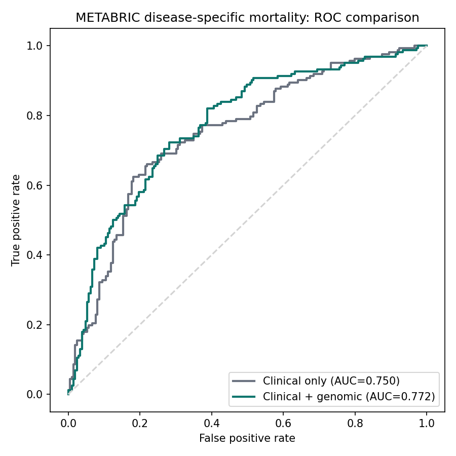
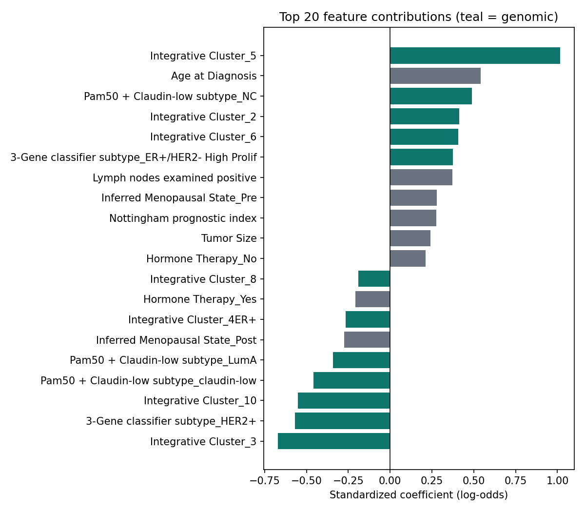

# Genomic-Clinical Risk Prediction (METABRIC Breast Cancer Cohort)

A disease-specific mortality model built on the **METABRIC** cohort (Molecular
Taxonomy of Breast Cancer International Consortium) — real, de-identified,
publicly available clinical and molecular data on ~2,500 breast cancer
patients — comparing a clinical-only risk model against a clinical +
genomic model to quantify the value of molecular subtyping.

**Question this project answers:** on top of standard clinical/pathological
staging, how much does molecular subtyping (PAM50, HER2 copy number,
integrative cluster, mutation burden) improve prediction of disease-specific
mortality?

> METABRIC is a research cohort
> published for scientific use. This project is for portfolio/methodology
> purposes 

---

## Results

Outcome: **disease-specific mortality** (Died of Disease vs Living — patients
who died of unrelated causes are excluded, since molecular subtype predicts
breast-cancer death specifically, not death from other causes). n = 1,483
patients with complete outcome data, 43.6% event rate, 75/25 train/test split.

| Model | AUC | Brier score |
|---|---|---|
| Clinical only (age, tumor size/stage/grade, nodal status, NPI, ER/PR status, treatment) | 0.750 | 0.203 |
| Clinical + genomic (+ PAM50 subtype, HER2 SNP6 status, integrative cluster, mutation count, 3-gene classifier) | **0.772** | **0.196** |

**+0.022 AUC** from adding the genomic/molecular layer — a real, modest,
literature-consistent effect. (For comparison: using *all-cause* mortality
as the target instead gives almost no genomic lift, ~+0.0004 AUC, because
all-cause mortality includes deaths unrelated to cancer that molecular
subtyping can't predict — a useful negative control that's included in
`train_model.py` history/reasoning.)




Top contributors include Nottingham prognostic index, nodal status, and grade
(clinical) alongside PAM50 Basal/claudin-low subtype and integrative cluster
membership (genomic) — consistent with known breast cancer biology, where
basal-like and claudin-low tumors carry worse prognosis independent of
standard staging.

---

## Get the data

The raw CSV (`data/Breast_Cancer_METABRIC.csv`) isn't committed to this repo —
METABRIC is distributed for research use via cBioPortal, so this project
points to the source rather than mirroring the file. To reproduce:

1. Download the METABRIC clinical dataset from
   [cBioPortal](https://www.cbioportal.org/study/summary?id=brca_metabric)
   (or the same file via [Kaggle](https://www.kaggle.com/datasets/raghadalharbi/breast-cancer-gene-expression-profiles-metabric),
   which mirrors the cBioPortal clinical fields used here).
2. Save it as `data/Breast_Cancer_METABRIC.csv`.
3. Run `python model/train_model.py` as below.

## Dataset

**Source:** METABRIC, distributed via [cBioPortal](https://www.cbioportal.org/)
(originally Curtis et al., *Nature* 2012; Pereira et al., *Nature
Communications* 2016). 2,509 patients, 34 clinical/pathological/genomic
fields, including PAM50 molecular subtype, HER2 status by SNP6 copy-number
assay, an integrative genomic cluster (from combined copy-number + expression
profiling), somatic mutation count, and standard clinical/treatment fields.

**Preprocessing:**
- Rows without a recorded vital status outcome are dropped.
- Rows recorded as "Died of Other Causes" are excluded from the target
  (see rationale above) rather than folded into either class.
- Remaining missing values are imputed (median for numeric, most-frequent
  for categorical) inside the sklearn pipeline — no rows are dropped for
  missing predictors, to preserve sample size.

## Project structure

```
metabric-risk-app/
├── requirements.txt
├── data/
│   └── Breast_Cancer_METABRIC.csv    # not committed, see "Get the data"
├── model/
│   ├── train_model.py            # trains + evaluates clinical-only vs full model
│   ├── metabric_model.joblib     # trained sklearn pipelines (both models)
│   ├── full_model_export.json    # coefficients, used by the React demo
│   ├── field_reference.json      # category options / numeric ranges for the UI
│   ├── metrics.json
│   ├── roc_curve.png
│   ├── feature_importance.png
│   └── calibration.png
└── app/
    ├── api.py                    # Flask inference API
    ├── streamlit_app.py          # ★ primary interactive front end
    └── RiskEstimator.jsx         # React demo (needs a React build step)
```

## Methodology

`train_model.py` fits two pipelines — `ColumnTransformer` (median-impute +
scale for numeric; mode-impute + one-hot for categorical) into
`LogisticRegression` — one on clinical/pathological features only, one on
clinical + genomic. AUC and Brier score on a held-out test set isolate the
genomic model's incremental contribution.

`api.py` is a Flask app exposing `POST /predict`, returning both the full
and clinical-only estimate so callers can see the genomic adjustment.

`streamlit_app.py` is the primary interactive front end — it loads
`metabric_model.joblib` and calls the real pipelines directly, so there's
no separate model logic to keep in sync.

`RiskEstimator.jsx` is an alternative React demo that re-implements the
exact trained logistic regression (coefficients exported to JSON, verified
to match the Python model's output bit-for-bit on a test sample) in the
browser, so it can run standalone without a Python backend. It needs a
React build step (see below) — Streamlit is the faster way to see this running.

## Running it

```bash
pip install -r requirements.txt
```

**Front end (recommended) — Streamlit:**
```bash
cd app
streamlit run streamlit_app.py
```
Opens at `http://localhost:8501`.

**API only — Flask:**
```bash
cd app
python api.py    # -> http://localhost:5000/predict
```

Example request:
```bash
curl -X POST http://localhost:5000/predict -H "Content-Type: application/json" -d '{
  "Age at Diagnosis": 61, "Tumor Size": 28, "Tumor Stage": 2,
  "Neoplasm Histologic Grade": 3, "Lymph nodes examined positive": 3,
  "Nottingham prognostic index": 5.1,
  "ER Status": "Negative", "PR Status": "Negative", "Chemotherapy": "Yes",
  "Hormone Therapy": "No", "Radio Therapy": "Yes",
  "Type of Breast Surgery": "Mastectomy", "Inferred Menopausal State": "Post",
  "Mutation Count": 6, "Pam50 + Claudin-low subtype": "Basal",
  "HER2 status measured by SNP6": "Neutral", "Integrative Cluster": "10",
  "3-Gene classifier subtype": "ER-/HER2-"
}'
```

**Retrain the model** (optional — a trained model is already included):
```bash
python model/train_model.py    # -> model/*.joblib, *.json, *.png
```

## Limitations & ethical notes

- **Research cohort, not a clinical tool.** METABRIC reflects a specific
  historical patient population (UK/Canada, diagnosed ~1990s-2000s); it is
  not necessarily representative of current practice, other ancestries, or
  other healthcare systems.
- **Modest sample after filtering** (n=1,483) relative to typical clinical
  prediction model guidance (e.g., TRIPOD) for 47 features — treat AUCs as
  indicative, not production-grade.
- **No external validation.** The model is evaluated on a held-out split of
  the same cohort, not an independent dataset — real deployment would need
  external validation before any clinical claim.
- **Genomic/molecular information carries privacy and psychological-impact
  considerations** in real deployments (insurance, family implications,
  emotional burden of mortality estimates); a production version would need
  informed consent and genetic-counseling integration.
- Intended purpose is to demonstrate a real, end-to-end clinical ML
  pipeline on public data — not to produce a usable diagnostic product.

